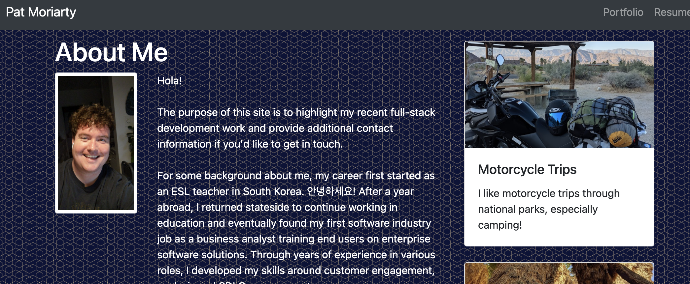

# React Portfolio
## Table of Contents

  - [Description](#description)
  - [Installation](#installation)
  - [Usage](#usage)
  - [Credits](#credits)
  - [License](#license)
  - [Contributing](#contributing)
  - [Questions](#questions)
    
## Description
    
The purpose of this app is to showcase my projects and portfolio using ReactJS.

    
## Installation
    
- Navigate to "https://pmo48.github.io/react-portfolio/" 
- Voila!
    
## Usage
    
- Giving 100% on homework
- Checking out my previous projects
- Downloading my resume
    
## License

[mit](https://choosealicense.com/licenses/mit/)
    
## Contributing
    
If you would like to contribute it, please utilize The [Contributor Covenant](https://www.contributor-covenant.org/) as a guideline.
    
## Questions
    
### What's your GitHub info?
    
My GitHub username is pmo48 and my profile can be found at github.com/pmo48
    
### What other contact info do you have?
    
I can be contacted via email at pmoriarty100@gmail.com if you have any additional questions.